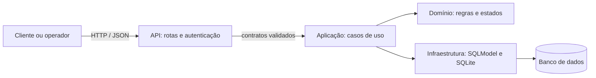

# Decisões de projeto

## Organização da aplicação

O código está separado por responsabilidade: `api` recebe e valida as requisições HTTP; `application` coordena os casos de uso; `domain` guarda os estados e tipos do negócio; `infrastructure` configura persistência e modelos do banco. Os contratos de entrada e saída ficam em `application/contracts.py`, para que os casos de uso não precisem importar os módulos das rotas.

As setas representam chamadas e uso de dados. A API traduz HTTP para chamadas da aplicação e converte erros de negócio em respostas HTTP padronizadas. As rotas não devem conter regras de estoque, pagamento ou fidelidade.

## Escopo do MVP

O fluxo demonstrável é pedido → pagamento simulado → preparação → entrega. A API persiste usuários, unidades, produtos, saldos por unidade, pedidos, itens, pagamentos e auditoria em SQLite. `canalPedido` é obrigatório, validado como enum e disponível como filtro.

O preço dos itens é copiado para o pedido no momento da compra. O pedido desconta o saldo durante a espera pelo pagamento; uma recusa restaura o estoque. Transições aceitas: `AGUARDANDO_PAGAMENTO → EM_PREPARACAO → PRONTO → ENTREGUE`; pagamento recusado leva a `CANCELADO`.

## Segurança e privacidade

- Dados pessoais do cliente: nome e e-mail; finalidade operacional: autenticação, identificação da conta e atendimento de pedidos. A hipótese legal para operações necessárias ao pedido deve ser validada pelo controlador; execução de contrato é uma hipótese prevista no art. 7º, V, da LGPD.
- Fidelidade é opcional. Seu consentimento é registrado com data e pode ser revogado sem impedir o cadastro ou a realização de pedidos. A adesão usa a hipótese de consentimento do art. 7º, I, e deve permanecer ligada à finalidade específica do programa.
- Senhas são armazenadas com hash Argon2. Tokens têm prazo de validade e endpoints verificam o perfil. A API mock não coleta nem armazena dados de cartão.
- A auditoria guarda identificador do ator, ação, tipo/ID do registro e horário; não deve guardar senha, token, dados de cartão ou conteúdo pessoal desnecessário.
- O controlador deve definir prazo de retenção por categoria. Ao encerrar a finalidade e não haver obrigação legal ou necessidade de exercício regular de direitos, avaliar eliminação ou anonimização. A implementação acadêmica não substitui uma política aprovada pelo controlador.

## Regras de fidelidade implementadas

- O cliente escolhe participar; o sistema guarda cada aceite ou revogação para preservar o histórico.
- Com consentimento ativo, cada R$ 1,00 efetivamente pago gera 1 ponto.
- A cada 100 pontos resgatados, o pedido recebe R$ 5,00 de desconto, desde que reste valor positivo para pagar.
- Resgate só ocorre em pedido próprio aguardando pagamento. Se o pagamento for recusado, os pontos resgatados são estornados.

## Promoções (proposta, ainda não implementada)

Uma campanha deve ter período de validade, unidades e produtos elegíveis, regra de desconto e estado ativo. O back-end deve avaliar a campanha, calcular o valor e registrar no pedido o desconto aplicado e a campanha correspondente. O cliente nunca informa o valor final do desconto.

## Persistência e migrações

Alembic controla versões do esquema. Para criar uma mudança, gerar uma revisão com `alembic revision --autogenerate -m "descricao"`, revisar o arquivo gerado e aplicar com `alembic upgrade head`. A aplicação não cria tabelas automaticamente ao iniciar.

## Referências de privacidade

- BRASIL. Lei nº 13.709, de 14 de agosto de 2018 (LGPD), especialmente arts. 6º, 7º, 8º e 18. [Texto compilado no Planalto](https://www.planalto.gov.br/ccivil_03/_ato2015-2018/2018/lei/l13709compilado.htm).
- AUTORIDADE NACIONAL DE PROTEÇÃO DE DADOS. [Direitos dos titulares](https://www.gov.br/anpd/pt-br/assuntos/titular-de-dados).
