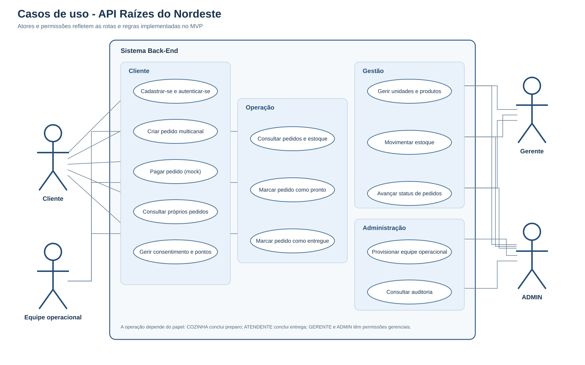
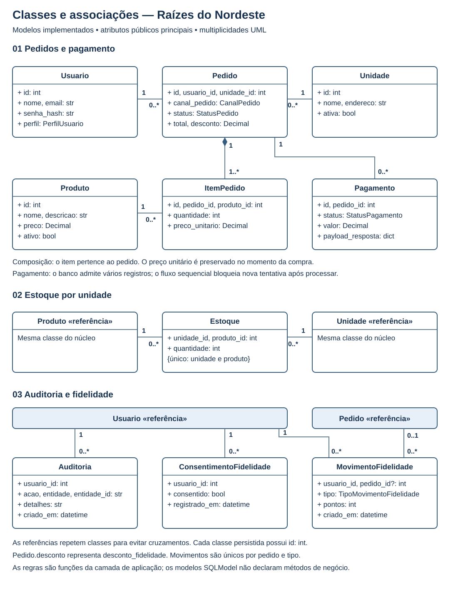
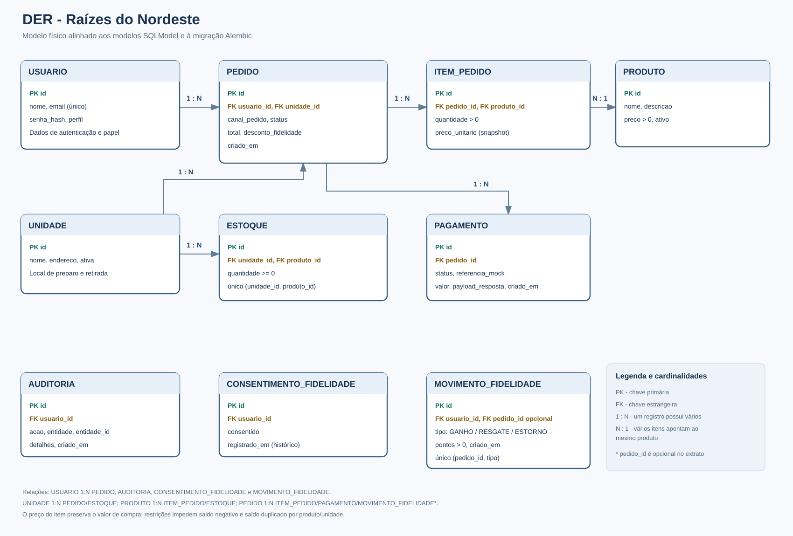
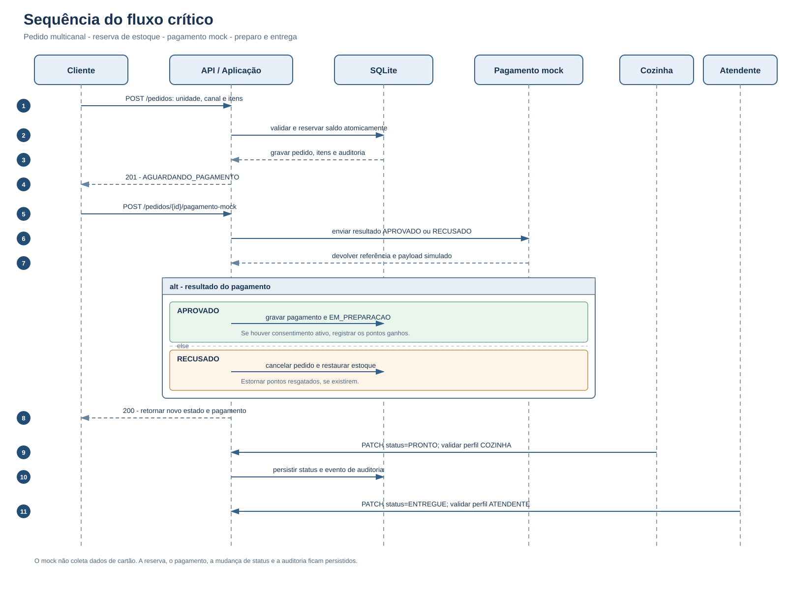

# Relatório técnico — Raízes do Nordeste

> Relatório técnico do projeto, preparado para revisão final conforme as regras ABNT da instituição.

**UNINTER - CENTRO UNIVERSITÁRIO INTERNACIONAL**  
**Magno Rodrigues Ramos Filho — RU 5023493**

## Projeto Multidisciplinar — Trilha Back-End

### API de pedidos da rede Raízes do Nordeste

GOIÂNIA - GOIÁS  
2026

## 1 Introdução e objetivos

Este projeto propõe e implementa um back-end para uma rede de lanchonetes que atende clientes por canais digitais e presenciais e opera em múltiplas unidades. O objetivo é demonstrar um fluxo persistente e reproduzível de pedido, reserva de estoque, pagamento simulado e atualização de status, com contratos de API, perfis de acesso e documentação técnica.

O recorte prioriza o fluxo crítico e a rastreabilidade. A API foi desenvolvida em Python com FastAPI, SQLModel e SQLite; as decisões de dependência e organização estão detalhadas no README do projeto.

## 2 Análise do problema e requisitos

O sistema precisa identificar a origem de cada pedido e controlar saldo por unidade. O estoque é reservado durante a espera pelo pagamento. Uma recusa cancela o pedido e devolve as quantidades. A aprovação encaminha o pedido para preparação; COZINHA pode marcá-lo como pronto e ATENDENTE pode concluir a entrega. O cliente consulta apenas os próprios pedidos, enquanto usuários internos têm acesso conforme o perfil.

O requisito multicanal é representado por `canalPedido`, obrigatório na criação e disponível como filtro. O preço de cada item é preservado como fotografia no momento da compra. As prioridades e o estado de cada requisito estão na [análise de requisitos](requisitos.md).

O MVP implementa autenticação, autorização por perfil, catálogo, estoque, pedidos, pagamento mock, fidelidade opcional e auditoria. Promoções permanecem como proposta; não são anunciadas como função disponível.

## 3 Modelagem e arquitetura

O código separa API, aplicação, domínio e infraestrutura. Rotas validam e encaminham solicitações; casos de uso aplicam as regras; tipos do domínio descrevem perfis, canais e estados; SQLModel e Alembic persistem e versionam os dados.

### 3.1 Casos de uso

O diagrama distingue os perfis COZINHA e ATENDENTE, além de GERENTE e ADMIN. O pagamento é mostrado como participante externo esperado na integração, mas o MVP executa somente um simulador interno, sem conexão de rede.

### 3.2 Diagrama de classes

As classes refletem os modelos SQLModel persistidos e suas associações. Chaves primárias, chaves estrangeiras, tipos relevantes e restrições de estoque e preço estão destacados.

### 3.3 Modelo de dados

As entidades cobrem usuários, unidades, produtos, saldos, pedidos, itens, pagamentos, auditoria, consentimentos e movimentos de fidelidade. Chaves estrangeiras e restrições de integridade conectam a modelagem ao banco implementado.

### 3.4 Sequência do fluxo crítico

### 3.5 Especificação do caso de uso crítico

**UC01 — Criar pedido e processar pagamento.** Ator principal: cliente autenticado. Participam a API, a aplicação, o banco SQLite e o simulador de pagamento. O caso começa quando o cliente envia unidade, canal, produtos e quantidades.

**Pré-condições.** O token é válido; a unidade está ativa; cada produto existe, está ativo e tem saldo suficiente; há pelo menos um item com quantidade positiva; o canal pertence a `APP`, `TOTEM`, `BALCAO`, `PICKUP` ou `WEB`.

**Fluxo principal.** A API valida identidade e contrato. A aplicação confere unidade, produto e saldo, calcula o valor e registra o pedido, os itens com preços unitários congelados, a reserva de estoque e a auditoria em uma transação. O cliente recebe o pedido em `AGUARDANDO_PAGAMENTO`. Quando o mock aprova, o pagamento e sua referência fictícia são registrados, o pedido passa a `EM_PREPARACAO` e, com consentimento ativo, os pontos do valor pago são lançados. COZINHA marca o pedido `PRONTO`; ATENDENTE o marca `ENTREGUE`.

**Pós-condição de aprovação.** O pedido está em preparação, o pagamento está aprovado, o estoque reservado continua abatido e os pontos aplicáveis estão registrados.

**Alternativa de recusa.** O pagamento é registrado como recusado; o pedido é cancelado, o estoque é devolvido e eventual resgate de pontos é estornado.

**Exceções.** Unidade ou produto ausente resulta em `404`; saldo insuficiente, pagamento repetido ou transição de estado incompatível resulta em `409`; contrato inválido resulta em `422`; perfil sem permissão resulta em `403`. Em falha de gravação, a transação é revertida e a resposta inclui identificador de requisição sem expor detalhes internos.

**Regras de negócio.** Canal é obrigatório; o cliente só acessa seus pedidos; a reserva por unidade/produto não pode produzir saldo negativo; falha em qualquer item desfaz toda a criação; o preço registrado não muda com o catálogo; cada pedido admite somente um processamento de pagamento; recusa devolve a reserva; COZINHA conclui preparo e ATENDENTE conclui entrega; fidelidade depende de consentimento; o pagamento simulado não coleta dados de cartão; operações sensíveis geram auditoria sem senha ou token.

Os critérios completos e numerados estão em [`fluxo-critico.md`](fluxo-critico.md).

## 4 API e regras de negócio

A API documenta autenticação, catálogo, estoque, pedidos, pagamento, fidelidade e auditoria na [referência de endpoints](api.md). O Swagger/OpenAPI local é servido em `/docs`, e o JSON OpenAPI em `/openapi.json`.

As entradas são validadas por contrato. `canalPedido` aceita `APP`, `TOTEM`, `BALCAO`, `PICKUP` ou `WEB`. O pedido exige itens válidos e saldo suficiente; quantidades e preços passam por validações. O pagamento mock registra uma referência e um payload fictícios, sem receber dados de cartão. As falhas usam envelope JSON uniforme com identificador de requisição.

## 5 Segurança, privacidade e LGPD

O cadastro público cria apenas perfil CLIENTE. Perfis internos são provisionados por ADMIN; os endpoints verificam o token e o perfil adequado. Senhas são armazenadas com hash Argon2 e tokens JWT têm prazo de validade. Respostas públicas de usuário não contêm hash nem senha.

São coletados nome e e-mail para cadastro, autenticação e atendimento dos pedidos. A hipótese de execução de contrato pode ser aplicável às operações necessárias à prestação solicitada; essa decisão cabe ao controlador, considerando o caso concreto. A adesão à fidelidade é opcional: o aceite ou a revogação é registrado com data e não impede o uso das funções de pedido.

O sistema evita coletar cartão de pagamento e orienta que logs não incluam senhas, tokens ou dados pessoais desnecessários. A retenção deve seguir finalidade, obrigações legais e política definida pelo controlador. Ao término da finalidade, deve-se avaliar eliminação ou anonimização e atender os direitos aplicáveis do titular. O documento de [decisões de projeto](decisoes-de-projeto.md) registra esses limites e as referências legais consultadas.

## 6 Entrega técnica e execução

Repositório público do projeto: <https://github.com/MagnoRamos06/api-raizes-do-nordeste>.

O repositório contém código, migração inicial, `.env.example`, README, coleção Postman, plano de cenários e diagramas. O README explica instalação, configuração, criação do banco, seed, execução e acesso ao Swagger. A migração cria o esquema de forma versionada; a API não cria tabelas automaticamente na inicialização.

O relatório acadêmico em PDF identifica instituição, estudante, RU, cidade e ano. A migração, o seed e a coleção Postman foram executados localmente; o resumo verificável está na [evidência de testes](evidencia-testes.md). O código, a documentação técnica, os diagramas, a migração e a coleção Postman estão publicados no repositório público do projeto.

## 7 Plano de testes

O plano descreve cenários positivos e negativos de autenticação, autorização, validação, estoque, pedido, pagamento recusado, fidelidade e auditoria. A coleção Postman organiza as chamadas do fluxo e scripts para guardar tokens e IDs.

Em 24/09/2026, a coleção foi executada contra uma instância local da API com um banco SQLite limpo: 31 chamadas e 31 scripts de teste passaram sem falhas. A evidência registra os fluxos positivos e negativos sem incluir credenciais.

## 8 Conclusão

O MVP fecha o fluxo pedido → pagamento mock → preparação → entrega, com persistência relacional, estoque por unidade, multicanalidade e autorização por perfil. Validações e erros padronizados tornam o comportamento mais previsível; auditoria registra operações relevantes. A fidelidade foi incluída como participação voluntária, com histórico de consentimento e estorno de pontos quando necessário.

Campanhas promocionais e integração com um provedor real de pagamento permanecem fora do escopo implementado. Essa priorização mantém o foco em demonstrar o fluxo principal com consistência. DER, casos de uso, sequência, requisitos e endpoints descrevem o mesmo escopo que o código; a coleção Postman reproduz o percurso principal e seus cenários negativos, executados com sucesso no ambiente local.

## Referências

BRASIL. Lei nº 13.709, de 14 de agosto de 2018. Lei Geral de Proteção de Dados Pessoais (LGPD). Brasília, DF: Presidência da República, 2018. Disponível em: <https://www.planalto.gov.br/ccivil_03/_ato2015-2018/2018/lei/l13709compilado.htm>. Acesso em: 24 set. 2026.

AUTORIDADE NACIONAL DE PROTEÇÃO DE DADOS. Direitos dos titulares. Brasília, DF: ANPD. Disponível em: <https://www.gov.br/anpd/pt-br/assuntos/titular-de-dados>. Acesso em: 24 set. 2026.
